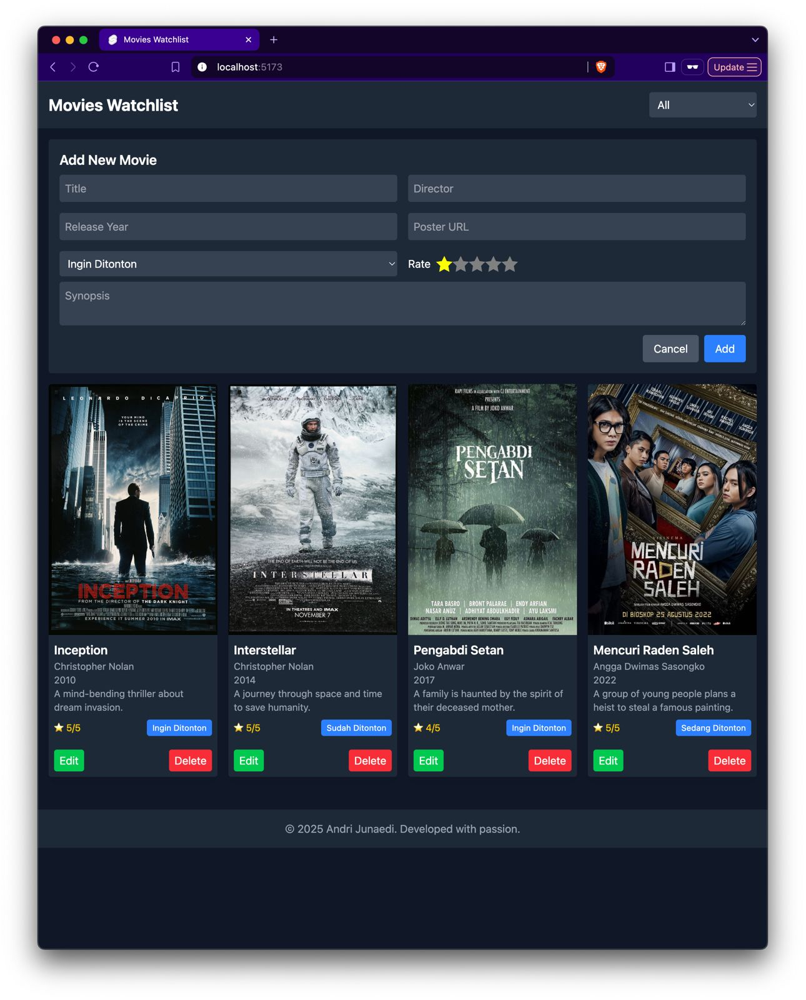

# Movies Watchlist

A responsive web application for managing your movie watchlist, inspired by Netflix. Built with **SvelteKit** and **TailwindCSS**, and deployed on **Cloudflare Pages**.

Live Demo: [Movies Watchlist]()

---

## Screenshots

<div style="display: grid; grid-template-columns: repeat(2, 1fr); gap: 16px;">
    
    
    
    
</div>

---

## Features

- **Add Movies**: Add new movies to your watchlist with details like title, director, release year, poster URL, synopsis, status, and rating.
- **Edit Movies**: Update movie details easily.
- **Delete Movies**: Remove movies from your watchlist.
- **Filter by Status**: Filter movies by their status (`Ingin Ditonton`, `Sedang Ditonton`, `Sudah Ditonton`).
- **Responsive Design**: Mobile-first design that adapts to desktop screens.

---

## Project Structure

```plaintext
movies-watchlist/
├── src/
│   ├── app.css             # Global styles
│   ├── app.html            # HTML template
│   ├── lib/
│   │   ├── data/
│   │   │   └── movies.ts   # Mock data for movies
│   │   └── index.ts        # Library entry point
│   ├── routes/
│   │   ├── +layout.svelte  # Layout component
│   │   ├── +page.svelte    # Main page for the watchlist
│   │   └── api/            # API endpoints for movies
│   └── static/             # Static assets (e.g., images)
├── .svelte-kit/            # SvelteKit generated files
├── package.json            # Project dependencies and scripts
├── svelte.config.js        # Svelte configuration
├── tailwind.config.cjs     # TailwindCSS configuration
└── vite.config.ts          # Vite configuration
```

---

## Installation

1. **Clone the repository**:
    ```bash
    git clone https://github.com/your-username/movies-watchlist.git
    cd movies-watchlist
    ```

2. **Install dependencies**:
    ```bash
    pnpm install
    ```

3. **Start the development server**:
    ```bash
    pnpm dev
    ```

4. **Open the app in your browser**:
    ```
    http://localhost:5173
    ```

---

## API Endpoints

### `GET /api/movies`
Fetch all movies in the watchlist.

### `POST /api/movies`
Add a new movie to the watchlist. Requires a JSON body with the following fields:
- `title`
- `director`
- `releaseYear`
- `poster`
- `synopsis`
- `status`
- `rating`

### `GET /api/movies/:id`
Fetch a specific movie by its ID.

### `PUT /api/movies/:id`
Update an existing movie. Requires a JSON body with updated fields.

### `DELETE /api/movies/:id`
Delete a movie by its ID.

---

## Technologies Used

- **SvelteKit**: Framework for building web applications.
- **TailwindCSS**: Utility-first CSS framework for styling.
- **Cloudflare Pages**: Deployment platform.
- **TypeScript**: For type safety.

---

## License

This project is licensed under the MIT License. See the LICENSE file for details.

---

## Author

Developed by Andri Junaedi with passion. 😊